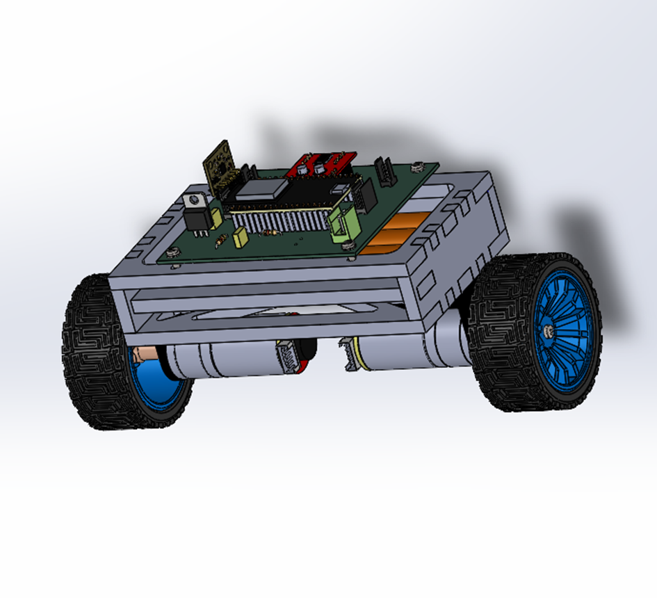

# Gyropode Control System



## Overview
This project implements a control system for a gyropode (self-balancing robot) using an ESP32 microcontroller. The system reads data from the MPU6050 sensor for angle estimation and wheel encoders for position and velocity feedback. It implements closed-loop control to maintain balance and respond to speed commands. The code is contained in a single main.cpp file for simplicity.

## Project Structure
```
gyro-raz
├── src
│   └── main.cpp         # Main application code
├── include              # Header files (currently empty)
├── info_old             # Old information folder
├── platformio.ini       # PlatformIO configuration file
└── README.md            # Project documentation
```

## Setup Instructions
1. **Clone the Repository**: 
   Clone this repository to your local machine using:
   ```
   git clone <repository-url>
   ```

2. **Install PlatformIO**: 
   Ensure you have PlatformIO installed in your development environment.

3. **Open the Project**: 
   Open the project folder in your PlatformIO IDE.

4. **Install Dependencies**: 
   The project uses the following libraries, which can be installed via PlatformIO:
   - Adafruit_MPU6050: For MPU6050 sensor communication
   - Adafruit_Sensor: Required for sensor data handling
   - ESP32Encoder: For encoder functionality on ESP32
   
   Install them by running:
   ```
   pio lib install "adafruit/Adafruit MPU6050"
   pio lib install "adafruit/Adafruit Unified Sensor"
   pio lib install "madhephaestus/ESP32Encoder"
   ```
   
   Alternatively, ensure all dependencies are installed by running:
   ```
   pio lib install
   ```

5. **Build the Project**: 
   Build the project using the PlatformIO build command.

6. **Upload to Board**: 
   Connect your ESP32 board and upload the code using:
   ```
   pio run --target upload
   ```

## Usage
- Once the code is uploaded, the system will start reading data from the MPU6050 sensor and wheel encoders.
- The control logic processes sensor data to maintain balance and control speed.
- Use the serial monitor to view debug information and adjust parameters via serial commands (e.g., "Kp 20.0").

## Contributing
Contributions are welcome! Please fork the repository and submit a pull request for any improvements or bug fixes.

## License
This project is licensed under the MIT License. See the LICENSE file for more details.